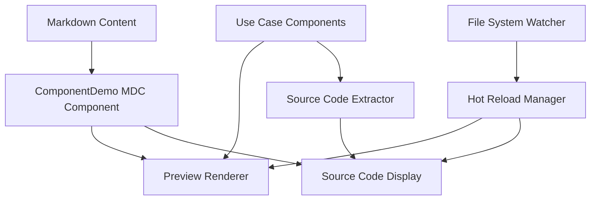

# Interactive Component Documentation System Design

## Overview

The Interactive Component Documentation System transforms static code examples into live, interactive demonstrations within the Nuxt Content documentation site. The system enables documentation authors to create individual Vue component files that serve as single sources of truth for component usage examples, automatically rendering both live previews and formatted source code displays.

## Architecture

### High-Level Architecture



### Component Hierarchy

- **ComponentDemo**: Main MDC component that orchestrates preview and source display
- **PreviewRenderer**: Handles live component rendering with isolation
- **SourceCodeDisplay**: Manages syntax highlighting and code formatting
- **FileSystemWatcher**: Monitors use case component changes for hot reload
- **ErrorBoundary**: Provides graceful error handling for failed component renders

## Components and Interfaces

### Core Components

#### ComponentDemo (MDC Component)
```typescript
interface ComponentDemoProps {
  src: string;           // Path to use case component (e.g., "button/01.severity")
  title?: string;        // Optional title override
  description?: string;  // Optional description
  showCode?: boolean;    // Whether to show source code (default: true)
  showPreview?: boolean; // Whether to show preview (default: true)
  height?: string;       // Preview container height
  background?: string;   // Preview background color/class
}
```

#### PreviewRenderer
```typescript
interface PreviewRendererProps {
  componentPath: string;
  isolationMode: 'iframe' | 'scoped' | 'none';
  errorFallback?: Component;
}

interface PreviewState {
  component: Component | null;
  error: Error | null;
  loading: boolean;
}
```

#### SourceCodeDisplay
```typescript
interface SourceCodeDisplayProps {
  code: string;
  language: string;
  filename: string;
  showLineNumbers?: boolean;
  highlightLines?: number[];
  collapsible?: boolean;
  maxHeight?: string;
}
```

### File System Structure

```
components/
├── docs/
│   ├── button/
│   │   ├── 01.severity.vue
│   │   ├── 02.sizes.vue
│   │   ├── 03.icons.vue
│   │   └── 04.interactive.vue
│   ├── input/
│   │   ├── 01.basic.vue
│   │   └── 02.validation.vue
│   └── table/
│       ├── 01.basic.vue
│       └── 02.sorting.vue
├── content/
│   └── ComponentDemo.vue
└── ui/
    ├── PreviewRenderer.vue
    ├── SourceCodeDisplay.vue
    └── ErrorBoundary.vue
```

## Data Models

### Use Case Component Metadata
```typescript
interface UseCaseComponent {
  id: string;              // Generated from file path
  path: string;            // Relative path from components/docs/
  filename: string;        // Original filename
  componentName: string;   // Extracted component name
  category: string;        // Component category (button, input, etc.)
  order?: number;          // Extracted from filename prefix
  title: string;           // Human-readable title
  description?: string;    // Optional description from component
  tags: string[];          // Extracted tags for filtering
  lastModified: Date;      // File modification timestamp
}
```

### Component Registry
```typescript
interface ComponentRegistry {
  components: Map<string, UseCaseComponent>;
  categories: Map<string, UseCaseComponent[]>;
  
  register(component: UseCaseComponent): void;
  unregister(id: string): void;
  getByPath(path: string): UseCaseComponent | null;
  getByCategory(category: string): UseCaseComponent[];
  search(query: string): UseCaseComponent[];
}
```

## Correctness Properties

*A property is a characteristic or behavior that should hold true across all valid executions of a system-essentially, a formal statement about what the system should do. Properties serve as the bridge between human-readable specifications and machine-verifiable correctness guarantees.*

<function_calls>
<invoke name="prework">
<parameter name="featureName">interactive-component-docs

### Property Reflection

After reviewing all properties identified in the prework, several can be consolidated to eliminate redundancy:

- Properties 2.1 and 4.1 both test component rendering - can be combined into a comprehensive rendering property
- Properties 3.1 and 3.2 both test source code display - can be combined into a source display property  
- Properties 4.3 and 4.5 both test error handling - can be combined into a comprehensive error handling property
- Properties 5.2 and 5.3 both test accessibility - can be combined into an accessibility property

**Property 1: Component Registration**
*For any* Vue file created in the components/docs/{component-name}/ directory, the Component_Documentation_System should register it in the component registry and make it available for embedding
**Validates: Requirements 1.1, 1.2**

**Property 2: Filename Metadata Extraction**
*For any* use case component filename following the naming convention, the system should correctly parse and extract metadata including order, category, and title
**Validates: Requirements 1.3**

**Property 3: Error Handling for Invalid Components**
*For any* use case component with invalid Vue syntax, the system should display appropriate error messages without crashing
**Validates: Requirements 1.5**

**Property 4: Component Rendering and Markdown Integration**
*For any* valid markdown reference to a use case component, the system should render both live preview and source code display correctly
**Validates: Requirements 2.1, 4.1**

**Property 5: Dependency Resolution**
*For any* use case component that imports external dependencies, the Preview_Renderer should resolve and load those dependencies correctly
**Validates: Requirements 2.3**

**Property 6: Component Isolation**
*For any* page with multiple use case components, each component should be isolated to prevent state or style conflicts
**Validates: Requirements 2.4**

**Property 7: Render Error Handling**
*For any* use case component that fails to render, the Preview_Renderer should display a fallback error state with diagnostic information
**Validates: Requirements 2.5**

**Property 8: Source Code Display**
*For any* use case component, the Source_Code_Display should show the complete Vue file source code with proper formatting
**Validates: Requirements 3.1**

**Property 9: Clipboard Functionality**
*For any* source code display, clicking the copy button should copy the formatted source code to the clipboard
**Validates: Requirements 3.3**

**Property 10: Long Content Handling**
*For any* source code that exceeds a reasonable length, the Source_Code_Display should provide appropriate UI controls for readability
**Validates: Requirements 3.4**

**Property 11: Sensitive Content Filtering**
*For any* source code containing sensitive patterns, the Source_Code_Display should filter or mask such content appropriately
**Validates: Requirements 3.5**

**Property 12: Configuration Options**
*For any* markdown syntax with configuration options, the Component_Documentation_System should parse and apply those options correctly
**Validates: Requirements 4.2**

**Property 13: Missing File Error Handling**
*For any* markdown reference to a non-existent component file, the system should display helpful error messages with suggestions
**Validates: Requirements 4.3, 4.5**

**Property 14: Accessibility Support**
*For any* interactive element in the component documentation system, proper keyboard navigation and ARIA attributes should be provided
**Validates: Requirements 5.2, 5.3**

**Property 15: Motion Preferences**
*For any* component with animations or transitions, the system should respect user preferences for reduced motion
**Validates: Requirements 5.5**

**Property 16: Library Extensibility**
*For any* new component library added to the project, the Component_Documentation_System should automatically detect and support it
**Validates: Requirements 6.4**

**Property 17: Build Error Diagnostics**
*For any* build error encountered, the Component_Documentation_System should provide clear diagnostic information
**Validates: Requirements 6.5**

## Error Handling

### Error Categories

1. **Component Loading Errors**
   - File not found
   - Invalid Vue syntax
   - Import resolution failures
   - Runtime component errors

2. **Markdown Parsing Errors**
   - Invalid syntax in component-demo blocks
   - Missing required parameters
   - Malformed configuration options

3. **Build-time Errors**
   - Component compilation failures
   - Dependency resolution issues
   - Type checking errors

### Error Recovery Strategies

- **Graceful Degradation**: Show error message with source code when preview fails
- **Fallback Components**: Use placeholder components for missing files
- **Error Boundaries**: Isolate component errors to prevent page crashes
- **Development Hints**: Provide actionable error messages with suggestions

## Testing Strategy

### Dual Testing Approach

The system will use both unit testing and property-based testing to ensure comprehensive coverage:

**Unit Testing**:
- Specific examples of component registration and rendering
- Edge cases like empty files, malformed syntax
- Integration points between markdown parsing and component rendering
- Error boundary behavior with known failure cases

**Property-Based Testing**:
- The system will use **fast-check** as the property-based testing library for JavaScript/TypeScript
- Each property-based test will run a minimum of 100 iterations to ensure thorough coverage
- Property-based tests will be tagged with comments referencing the design document properties
- Tag format: `**Feature: interactive-component-docs, Property {number}: {property_text}**`

**Property Test Coverage**:
- Component registration with various file structures and naming patterns
- Markdown parsing with different syntax variations and configurations
- Error handling with various types of invalid inputs
- Source code extraction and formatting across different Vue component structures
- Accessibility attribute generation for different component types

**Unit Test Coverage**:
- Specific component examples (Button severity variants, Input validation states)
- Known error conditions (missing files, syntax errors)
- Integration between Nuxt Content and the component system
- Clipboard functionality and user interactions

Together, unit tests catch concrete bugs while property tests verify the system behaves correctly across all possible inputs, ensuring robust component documentation functionality.

## Implementation Architecture

### Nuxt Integration

The system integrates with Nuxt through several mechanisms:

1. **MDC Component Registration**: ComponentDemo registered as global MDC component
2. **Build-time Component Discovery**: Nuxt plugin scans components/docs/ during build
3. **Hot Reload Integration**: File watcher updates component registry during development
4. **SSR Compatibility**: Components render correctly in both SSR and client-side modes

### File System Watcher

```typescript
interface FileWatcher {
  watchPath: string;
  patterns: string[];
  
  onFileAdded(callback: (path: string) => void): void;
  onFileChanged(callback: (path: string) => void): void;
  onFileRemoved(callback: (path: string) => void): void;
}
```

### Component Loader

```typescript
interface ComponentLoader {
  loadComponent(path: string): Promise<Component>;
  loadSourceCode(path: string): Promise<string>;
  resolveImports(component: Component): Promise<void>;
  validateComponent(component: Component): ValidationResult;
}
```

## Performance Considerations

### Optimization Strategies

1. **Lazy Loading**: Components loaded only when needed
2. **Code Splitting**: Use case components bundled separately
3. **Caching**: Component metadata and source code cached
4. **Virtual Scrolling**: For pages with many component examples
5. **Debounced Updates**: File watcher changes debounced to prevent excessive updates

### Bundle Size Management

- Tree-shaking for unused components
- Dynamic imports for heavy dependencies
- Separate chunks for component documentation assets
- Compression for source code storage

## Security Considerations

### Content Security Policy

- Restrict component execution to safe contexts
- Sanitize user-provided configuration options
- Prevent XSS through source code display
- Validate component imports against allowlist

### Sensitive Information Handling

- Filter environment variables from source code
- Mask API keys and secrets in examples
- Prevent access to system files outside components/docs/
- Validate file paths to prevent directory traversal

## Deployment Strategy

### Build Process Integration

1. **Component Discovery**: Scan and register all use case components
2. **Validation**: Verify all components compile successfully  
3. **Asset Generation**: Pre-generate source code and metadata
4. **Bundle Optimization**: Tree-shake unused components and dependencies

### Production Optimizations

- Pre-compiled component registry
- Minified source code storage
- CDN-friendly asset structure
- Efficient caching headers for component assets